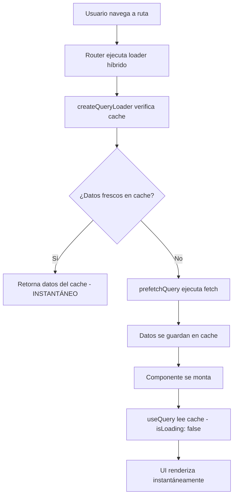

# Arquitectura Híbrida: React Router Loaders + TanStack Query

## 📋 Resumen

Esta documentación describe la implementación de una **solución híbrida** que combina React Router Loaders con TanStack Query para obtener lo mejor de ambos mundos:

- ✅ **Navegación instantánea** (React Router Loaders)
- ✅ **Cache inteligente** (TanStack Query)
- ✅ **Estado reactivo** (TanStack Query)
- ✅ **Background updates** (TanStack Query)

## 🏗️ Arquitectura

### Flujo de Navegación Optimizado



### Componentes de la Arquitectura

1. **`query-loader-utils.ts`**: Utilidades core para la integración
2. **Loaders híbridos**: Pre-pueblan el cache de TanStack Query
3. **Query hooks**: Leen datos del cache con estado reactivo
4. **Global QueryClient**: Singleton para uso en loaders

## 🛠️ Implementación

### 1. Utilidad Core (`query-loader-utils.ts`)

```typescript
/**
 * Crea un loader que pre-puebla el cache de TanStack Query
 */
export const createQueryLoader = <T>(
  queryKey: readonly unknown[],
  queryFn: () => Promise<T>,
  options?: {
    staleTime?: number;
    gcTime?: number;
  }
) => {
  return async () => {
    const queryClient = getGlobalQueryClient();

    // Verificar si ya tenemos datos frescos en cache
    const existingData = queryClient.getQueryData(queryKey);
    const queryState = queryClient.getQueryState(queryKey);

    // Si tenemos datos frescos, no hacer fetch
    if (existingData && queryState && !queryState.isInvalidated) {
      const now = Date.now();
      const staleTime = options?.staleTime ?? ONE_HOUR_MS;
      const dataTime = queryState.dataUpdatedAt;

      if (now - dataTime < staleTime) {
        return existingData; // 🚀 INSTANTÁNEO
      }
    }

    // Pre-poblar el cache
    try {
      await queryClient.prefetchQuery({
        queryKey,
        queryFn,
        staleTime: options?.staleTime ?? ONE_HOUR_MS,
        gcTime: options?.gcTime ?? TWO_HOURS_MS,
      });

      return queryClient.getQueryData(queryKey);
    } catch (error) {
      console.warn("Loader prefetch failed, component will handle loading:", error);
      return null;
    }
  };
};
```

### 2. Inicialización en QueryProvider

```typescript
// shared/providers/query-provider.tsx
import { initializeGlobalQueryClient } from "@/shared/router/utils/query-loader-utils";

export const QueryProvider = ({ children }: { children: React.ReactNode }) => {
  const [queryClient] = useState(
    () =>
      new QueryClient({
        defaultOptions: {
          queries: {
            staleTime: ONE_HOUR, // 1 hora por defecto
            gcTime: TWO_HOURS, // 2 horas en cache
            refetchOnWindowFocus: false,
            refetchOnReconnect: true,
            retry: 2,
          },
        },
      })
  );

  // 🔑 Inicializar el cliente global para loaders
  useEffect(() => {
    initializeGlobalQueryClient(queryClient);
  }, [queryClient]);

  return (
    <QueryClientProvider client={queryClient}>
      {children}
      <ReactQueryDevtools initialIsOpen={false} />
    </QueryClientProvider>
  );
};
```

### 3. Loader Híbrido

```typescript
// shared/router/loaders/customers-loader.ts
import { fetchClientList } from "@/features/customers/actions/query";
import { createQueryLoader } from "@/shared/router/utils/query-loader-utils";

export const customersLoader = createQueryLoader(
  ["clientList"], // ⚠️ Query key que DEBE coincidir con useClientList
  fetchClientList,
  {
    staleTime: ONE_HOUR, // 1 hora - datos frescos
    gcTime: TWO_HOURS, // 2 horas - garbage collection
  }
);
```

### 4. Hook de Query Optimizado

```typescript
// features/customers/hooks/use-client-list.ts
export const useClientList = () => {
  const { data, error, isLoading, isFetching, refetch } = useQuery({
    queryKey: ["clientList"], // ⚠️ DEBE coincidir con el loader
    queryFn: fetchClientList,
    staleTime: ONE_HOUR,
    gcTime: TWO_HOURS,
    refetchOnWindowFocus: false,
    refetchOnReconnect: true,

    // ✨ Si el loader ya cargó los datos, isLoading será false
    initialDataUpdatedAt: () => Date.now(),
  });

  return {
    data,
    error,
    isLoading, // false si el loader ya pre-pobló los datos
    isFetching, // true cuando hay background updates
    refetch,
  };
};
```

### 5. Configuración de Rutas

```typescript
// shared/router/routes.tsx
export const router = createBrowserRouter([
  {
    path: "/",
    loader: dashboardLoader, // Loader híbrido
    middleware: [authProtectedMiddleware],
    element: <SidebarLayout />,
    errorElement: <RouteErrorBoundary />,
    children: [
      {
        path: "customers",
        loader: customersLoader, // ✅ Pre-puebla cache
        element: <CustomersRoute />,
      },
      // ... otras rutas
    ],
  },
]);
```

## 🎯 Patrones de Uso

### Para Rutas con Datos Específicos

```typescript
// 1. Crear el loader híbrido
export const myFeatureLoader = createQueryLoader(
  ["myFeature"], // Query key único
  fetchMyFeatureData, // Función de fetch
  {
    staleTime: ONE_HOUR,
    gcTime: TWO_HOURS,
  }
);

// 2. Crear el hook correspondiente
export const useMyFeature = () => {
  return useQuery({
    queryKey: ["myFeature"], // ⚠️ DEBE coincidir
    queryFn: fetchMyFeatureData,
    staleTime: ONE_HOUR,
    gcTime: TWO_HOURS,
    // ... otras opciones
  });
};

// 3. Usar en la configuración de rutas
{
  path: "my-feature",
  loader: myFeatureLoader,
  element: <MyFeatureRoute />,
}
```

### Para Rutas sin Datos Específicos

```typescript
// Usar el loader genérico para rutas protegidas
export const protectedRouteLoader = createQueryLoader(["protectedRoute"], () => Promise.resolve(null), {
  staleTime: ONE_HOUR,
  gcTime: TWO_HOURS,
});
```

## 📊 Beneficios y Resultados

### Comparación de Performance

| Métrica                     | Antes (Solo TanStack Query) | Después (Híbrido)            |
| --------------------------- | --------------------------- | ---------------------------- |
| **Primera carga**           | Normal                      | Normal + cache pre-poblado   |
| **Navegación subsecuente**  | Re-fetch cada vez           | ⚡ **Instantánea**           |
| **isLoading en componente** | true inicialmente           | false (datos ya disponibles) |
| **UX percibida**            | Carga visible               | Navegación fluida            |
| **Network requests**        | Frecuentes                  | Minimizadas                  |

### Tipos de Navegación

1. **Primera visita** (cache vacío):

   - Loader ejecuta fetch
   - Cache se pre-puebla
   - Componente monta con datos
   - **Resultado**: Carga normal pero optimizada

2. **Navegación subsecuente** (< 1 hora):

   - Loader detecta datos frescos
   - Retorna datos del cache instantáneamente
   - **Resultado**: ⚡ **Navegación instantánea**

3. **Datos stale** (> 1 hora):
   - Loader ejecuta fetch en background
   - Usuario ve datos viejos mientras se actualiza
   - **Resultado**: UX fluida + datos actualizados

## 🔧 Configuración Avanzada

### Cache Personalizado por Feature

```typescript
// Para datos que cambian frecuentemente
export const realtimeLoader = createQueryLoader(["realtime"], fetchRealtimeData, {
  staleTime: 30_000, // 30 segundos
  gcTime: 300_000, // 5 minutos
});

// Para datos estáticos
export const staticLoader = createQueryLoader(["static"], fetchStaticData, {
  staleTime: 24 * 60 * 60 * 1000, // 24 horas
  gcTime: 48 * 60 * 60 * 1000, // 48 horas
});
```

### Invalidación Manual

```typescript
import { invalidateQueries } from "@/shared/router/utils/query-loader-utils";

// En un action o mutation
const handleUpdate = async () => {
  await updateData();
  // Invalidar cache específico
  invalidateQueries(["clientList"]);
};
```

### Obtener Datos del Cache

```typescript
import { getCachedData } from "@/shared/router/utils/query-loader-utils";

// En un loader o función
const cachedClients = getCachedData<ClientList[]>(["clientList"]);
if (cachedClients) {
  // Usar datos del cache
}
```

## 🚨 Consideraciones Importantes

### Query Keys DEBEN Coincidir

```typescript
// ❌ MAL - Query keys diferentes
// loader.ts
export const loader = createQueryLoader(["clients"], fetchClients);
// hook.ts
export const useClients = () => useQuery({ queryKey: ["clientList"], ... });

// ✅ BIEN - Query keys idénticos
// loader.ts
export const loader = createQueryLoader(["clientList"], fetchClients);
// hook.ts
export const useClients = () => useQuery({ queryKey: ["clientList"], ... });
```

### Configuración de Tiempo Consistente

```typescript
// ✅ BIEN - Usar las mismas constantes
const CACHE_CONFIG = {
  staleTime: ONE_HOUR,
  gcTime: TWO_HOURS,
};

// En loader
export const loader = createQueryLoader(["data"], fetchData, CACHE_CONFIG);

// En hook
export const useData = () =>
  useQuery({
    queryKey: ["data"],
    queryFn: fetchData,
    ...CACHE_CONFIG,
  });
```

## 🧪 Testing

### Testing de Loaders

```typescript
import { createQueryLoader } from "@/shared/router/utils/query-loader-utils";

describe("customersLoader", () => {
  it("should prefetch data and return from cache", async () => {
    // Mock del QueryClient global
    const mockQueryClient = {
      getQueryData: jest.fn(),
      getQueryState: jest.fn(),
      prefetchQuery: jest.fn(),
    };

    // Test del comportamiento del loader
    const loader = createQueryLoader(["test"], fetchTestData);
    const result = await loader();

    expect(result).toBeDefined();
  });
});
```

### Testing de Hooks

```typescript
import { renderHook } from "@testing-library/react";
import { QueryClient, QueryClientProvider } from "@tanstack/react-query";

describe("useClientList", () => {
  it("should return cached data immediately", () => {
    const queryClient = new QueryClient({
      defaultOptions: { queries: { retry: false } },
    });

    // Pre-poblar cache
    queryClient.setQueryData(["clientList"], mockData);

    const wrapper = ({ children }) => <QueryClientProvider client={queryClient}>{children}</QueryClientProvider>;

    const { result } = renderHook(() => useClientList(), { wrapper });

    expect(result.current.isLoading).toBe(false);
    expect(result.current.data).toEqual(mockData);
  });
});
```

## 📈 Monitoreo y Debug

### React Query Devtools

Los datos pre-cargados por loaders son visibles en React Query Devtools:

- **Query Key**: Identificador único
- **Status**: fresh/stale/loading
- **Data**: Contenido del cache
- **Last Updated**: Timestamp de última actualización

### Console Warnings

El sistema incluye warnings útiles:

```typescript
// En caso de error en loader
console.warn("Loader prefetch failed, component will handle loading:", error);
```

### Performance Monitoring

```typescript
// Medir tiempo de navegación
const startTime = performance.now();
// ... navegación ...
const endTime = performance.now();
console.log(`Navigation took ${endTime - startTime} ms`);
```

## 🔄 Migración de Loaders Existentes

### Antes (Loader Tradicional)

```typescript
export async function customersLoader() {
  return {
    clientList: await fetchClientList(),
  };
}
```

### Después (Loader Híbrido)

```typescript
export const customersLoader = createQueryLoader(["clientList"], fetchClientList, {
  staleTime: ONE_HOUR,
  gcTime: TWO_HOURS,
});
```

## 🎯 Conclusión

Esta arquitectura híbrida proporciona:

- ⚡ **Navegación instantánea** después de la primera carga
- 🧠 **Cache inteligente** con invalidación automática
- 🔄 **Estado reactivo** para actualizaciones en tiempo real
- 🛡️ **Error handling robusto** con fallbacks
- 📊 **Monitoring integrado** con React Query Devtools

El resultado es una **experiencia de usuario significativamente superior** manteniendo toda la funcionalidad de React Router y agregando el poder de TanStack Query.
