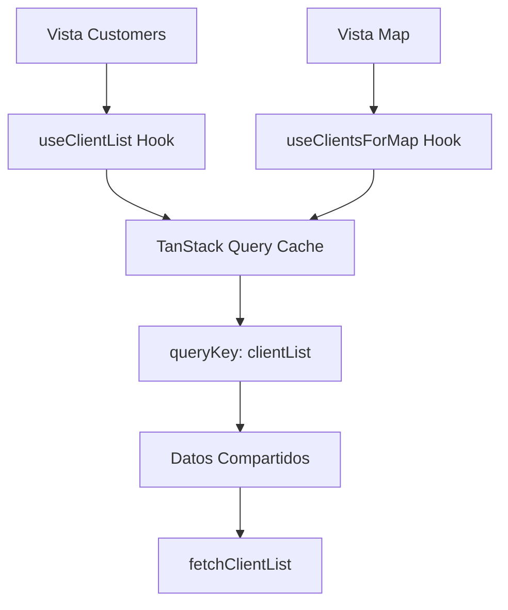

# Integración de Datos entre Features

## Mapa de Clientes - Cache Compartido

### Resumen

El feature `map` ahora reutiliza los datos de clientes que ya están cacheados por el feature `customers`, evitando duplicar requests y manteniendo sincronización entre vistas.

### Implementación

#### 1. Hook Compartido: `useClientsForMap`

- **Ubicación**: `src/features/map/hooks/use-clients-for-map.ts`
- **Propósito**: Accede a los datos del caché usando la misma query key `["clientList"]`
- **Transformación**: Convierte `ClientList` a `ClientLocation` para compatibilidad con el mapa

```typescript
export const useClientsForMap = () => {
  const { data, error, isLoading, isFetching } = useQuery({
    queryKey: ["clientList"], // ⭐ Misma key que customers
    queryFn: fetchClientList,
    // ... configuración idéntica al hook de customers
  });

  // Transformación de datos para el mapa
  const clients: ClientLocation[] = data?.map(convertClientToMapFormat) || [];

  return {
    clients, // Todos los clientes transformados
    allClients: data || [], // Datos originales sin transformar
    totalClients, // Conteo total
    activeClients, // Clientes activos
    clientsWithCoordinates, // Clientes con ubicación válida
    // ... estados de loading y error
  };
};
```

#### 2. Beneficios de la Implementación

##### Cache Compartido

- ✅ **No duplica requests**: Si el usuario ya visitó `/customers`, los datos están en caché
- ✅ **Sincronización automática**: Cambios en una vista se reflejan en la otra
- ✅ **Performance mejorada**: Datos instantáneos desde el caché

##### Estadísticas Dinámicas

- ✅ **Total Clientes**: Muestra el conteo real de clientes registrados
- ✅ **Clientes Activos**: Filtra por estado "activo"
- ✅ **Con Ubicación**: Cuenta clientes con coordenadas válidas
- ✅ **En el Mapa**: Muestra cuántos se están visualizando actualmente

##### Estados de Carga

- ✅ **Loading State**: Spinner mientras se cargan los datos
- ✅ **Error Handling**: Manejo de errores desde el hook original

#### 3. Flujo de Datos



### Configuración de Coordenadas

#### Valores por Defecto

- **Latitud**: 6.5244 (Lagos, Nigeria)
- **Longitud**: 3.3792 (Lagos, Nigeria)

#### Filtrado de Ubicaciones

- Los clientes sin coordenadas válidas usan las coordenadas por defecto
- El contador "Con Ubicación" solo cuenta clientes con coordenadas diferentes a las por defecto

### Navegación por Cliente Específico

#### Rutas Disponibles

- `/map` - Muestra todos los clientes
- `/map/:clientId` - Muestra un cliente específico

#### Lógica de Visualización

```typescript
// Si hay clientId en la URL, mostrar solo ese cliente
const mapClients = isViewingSpecificClient && selectedClient ? [convertClientToMapFormat(selectedClient)] : clients; // Sino, mostrar todos los clientes del caché
```

### Próximas Mejoras Sugeridas

1. **Filtros Avanzados**: Filtrar por estado, zona, etc.
2. **Clustering**: Agrupar marcadores cercanos
3. **Rutas de Cobradores**: Mostrar rutas y tracking en tiempo real
4. **Heatmaps**: Visualizar densidad de clientes por zona
5. **Métricas de Distancia**: Calcular distancias entre puntos
